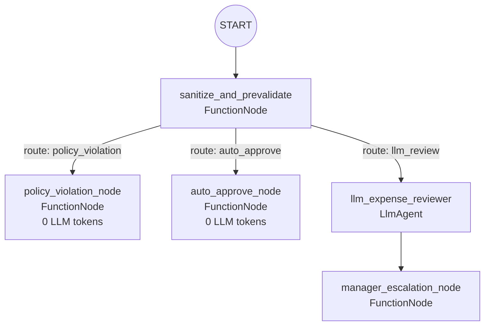

# ambient-expense-agent

An event-driven expense approval agent: it doesn't chat, it processes an incoming expense report and returns a decision. Built with ADK 2.0's Graph Workflow API to demonstrate conditional routing — most reports never touch the LLM at all.

Guiding project of the "Accelerate Agent Development with Antigravity and Agents CLI" course (part of the "Use Agents to Build Agents" path).

## Architecture



Unlike a fan-out graph where every branch runs, this is **conditional routing**: `sanitize_and_prevalidate` picks exactly one of the three branches per report, via `EventActions(route=...)`, and the other two never execute. Only the `llm_review` path ever calls the model.

## Routing logic

`sanitize_and_prevalidate` runs first on every report, regardless of format (accepts a typed `ExpenseReport`, a raw dict, JSON text, or free-form natural language — it tries each in turn, falling back to regex-based amount/category extraction for the last case). Before anything else, it **redacts anything that looks like an SSN** (`\d{3}-\d{2}-\d{4}`) from the description — deterministically, so no PII reaches the LLM even on the branch that uses one.

Then it routes:

| Condition | Route | What happens |
|---|---|---|
| Category in `{gambling, crypto, alcohol, firearms, personal}` | `policy_violation` | Rejected outright, deterministically. Zero LLM calls. |
| Amount < $100 **and** category in `{meals, travel, office_supplies, software, training}` | `auto_approve` | Approved outright, deterministically. Zero LLM calls. |
| Anything else (amount ≥ $100, or an uncategorized/ambiguous report) | `llm_review` | Goes to `llm_expense_reviewer`, an `LlmAgent` with a structured `output_schema` (summary, risk assessment, recommended action), then to `manager_escalation_node` for human sign-off. |

Every path produces a status (`APPROVED`, `REJECTED_POLICY_VIOLATION`, or `PENDING_MANAGER_REVIEW`) with a generated ID (`APV-…`, `VIO-…`, `TKT-…`) and a timestamp — the point being that even the two deterministic paths return a fully-formed, auditable result, not just a yes/no.

## Deployment

```bash
cd ambient-expense-agent
agents-cli deploy
```

## Notes

- Needs only a GCP project (or a Gemini API key) to run — see `.env.example`. No external database or datastore to provision; the policy rules (`AUTO_APPROVE_THRESHOLD`, `ALLOWED_CATEGORIES`, `PROHIBITED_CATEGORIES`) are constants in `app/agent.py`.
- The auto-approve/policy-violation branches are a good example of "zero-token" nodes in an agentic workflow — deterministic Python, not model calls, used specifically because the decision doesn't require judgment.
