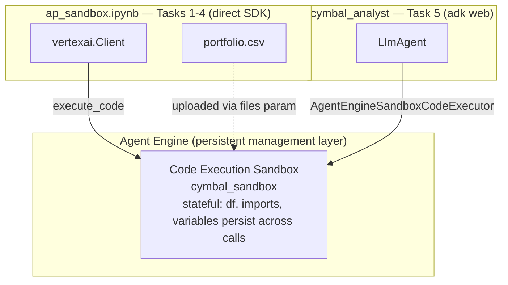
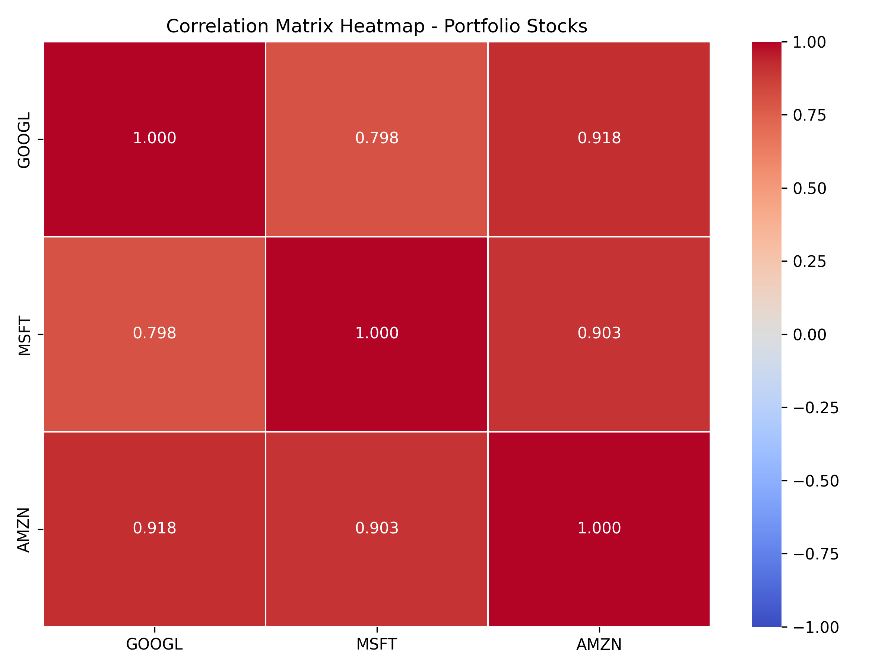
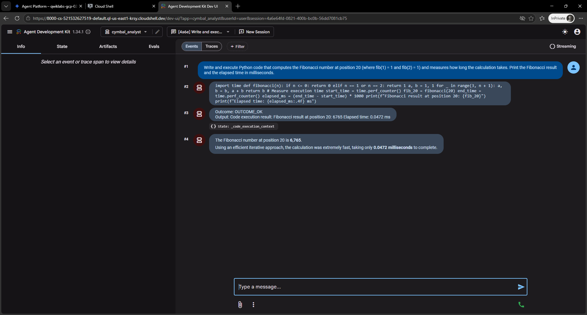

# code-execution-sandbox — Cymbal Analytics Portfolio Analyst

Demonstrates Gemini Enterprise Agent Platform's **Code Execution** feature: a secure, isolated sandbox (no outbound network, no host access, 125+ pre-loaded packages including NumPy/Pandas/Matplotlib) that runs Python code on demand and persists state across calls. A hedge fund's portfolio-analysis workflow — daily returns, annualized volatility, Sharpe ratio, a performance chart — is run first via direct SDK calls, then via an ADK agent that generates and executes the same kind of code autonomously from natural-language prompts, against the *same* sandbox.

Based on Google Cloud Skills lab **GENAI163** — "Analyze Financial Portfolios with Gemini Enterprise Agent Platform Code Execution", part of the [Build and Deploy Agents with Agent Development Kit (ADK)](https://partner.skills.google/paths/4144) path (course "Build Enterprise Agents with Code Execution on Gemini Enterprise Agent Platform").

## Architecture



Two independent clients talk to the **same sandbox resource**, sharing its in-memory state:
- The notebook (`ap_sandbox.ipynb`) creates the Agent Engine + sandbox, uploads a portfolio CSV, and runs Tasks 1-4 by hand-writing the Python that gets sent through `client.agent_engines.sandboxes.execute_code(...)`.
- `cymbal_analyst` (`cymbal_analyst/agent.py`) is an ADK `LlmAgent` wired to that same `sandbox_resource_name` via `AgentEngineSandboxCodeExecutor`. Run with `adk web`, it writes and runs its own Python in response to plain-English prompts — no manual coding.

Because the sandbox's Python process persists between calls, the portfolio DataFrame (`df`) loaded once in Task 3 is still there when the ADK agent queries it in Task 5 — no re-uploading, no re-parsing.

## Real run results (2026-09-04)

Sample portfolio: 10 days of GOOGL/MSFT/AMZN closing prices (Jan 2024). Computed both by hand (Task 4, direct SDK) and reproduced independently by `cymbal_analyst` (Task 5) against the same `df` — used to cross-check that the agent's autonomously-generated code matches the manual calculation.

| Ticker | Annualized Return | Annualized Volatility | Sharpe Ratio (risk-free 4.5%) |
|---|---|---|---|
| GOOGL | 106.80% | 17.07% | 5.9914 |
| MSFT | 77.95% | 10.08% | 7.2872 |
| AMZN | 136.57% | 13.71% | **9.6365** (best risk-adjusted) |

A normalized performance chart (`portfolio_performance.png`, generated inside the sandbox and retrieved as raw bytes via the API — the sandbox has no way to write anywhere else) is checked into this folder as a real artifact.

`cymbal_analyst` was also prompted with the manual's open-ended example — "generate a correlation matrix heatmap of the three stocks using seaborn, and save it as a PNG" — with no further guidance on how to compute or present it. Result:



And, as a smoke test unrelated to the portfolio data, `cymbal_analyst` was asked to compute `fib(20)` with timing — result and full event trace from the ADK Dev UI:



`fib(20) = 6,765`, computed inside the sandbox in `0.0472 ms`.

## Setup

```bash
cd code-execution-sandbox
python3 -m pip install -r requirements.txt
```

Create `.env` (see `ap_sandbox.ipynb` Task 1 for the exact cell):

```
GOOGLE_GENAI_USE_VERTEXAI=TRUE
GOOGLE_CLOUD_PROJECT=<your-project-id>
GOOGLE_CLOUD_LOCATION=global
MODEL=<a Gemini model id>
```

Then run the notebook through Task 2 — it appends `SANDBOX_RESOURCE_NAME` to `.env` once the sandbox is created, which `cymbal_analyst/agent.py` reads at import time (and asserts is set, so `adk web` fails fast with a clear message if you skip this step).

```bash
adk web
```

## Notes

- **The sandbox always runs in `us-central1`**, regardless of what `GOOGLE_CLOUD_LOCATION` says in `.env` (here it's `global`, since that's what the rest of the Vertex AI client uses). `ap_sandbox.ipynb` hardcodes `LOCATION = "us-central1"` for the client init specifically because of this — worth knowing if you see resources appear in a region your `.env` doesn't mention.
- **`.env` ends up with a duplicate `SANDBOX_RESOURCE_NAME` key** after running the "Add the sandbox resource name to .env" notebook cell: the file already had a placeholder line (`PASTE_YOUR_SANDBOX_RESOURCE_NAME_HERE`) from an earlier step, and the cell's bash-magic append adds the real value as a second line below it. Harmless in practice (`python-dotenv`, like most `.env` parsers, takes the last occurrence of a repeated key), but a rough edge worth knowing about if you're debugging why the agent picked up an unexpected value.
- **`cymbal_analyst/agent.py` adds retry handling** (`types.HttpRetryOptions`, wrapping the model in `Gemini(model=..., retry_options=...)`) that isn't in the lab manual's version of the file — a defensive addition for transient model-call failures, relevant given the manual itself warns that `adk web` can occasionally return an `UNEXPECTED_TOOL_CALL` finish reason.
- **Task 6 (cleanup)** — `agent_engine.delete(force=True)` cascades to any remaining sandboxes; see the last cell of `ap_sandbox.ipynb`. Since this was built on an ephemeral Qwiklabs project, the whole project (and everything in it) is torn down regardless of whether that cell gets run — but in your own GCP project, run it to avoid ongoing charges.
- This won't run out of the box outside a project with Vertex AI enabled and billing configured — see `.env` above.
