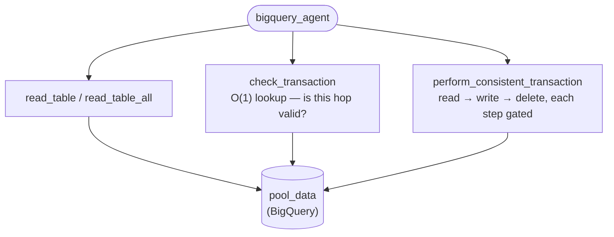
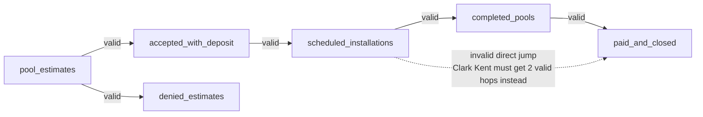

# eval-challenge-lab

ADK agent for **Cymbal Pools**, a fictional swimming pool installation company, that manages customer records as they move through a BigQuery-backed pipeline (`pool_estimates → accepted_with_deposit → scheduled_installations → completed_pools → paid_and_closed`, with `denied_estimates` as a dead-end branch).

Based on Google Cloud Skills Challenge Lab **GENAI155** — "Evaluate and Improve Agent Development Kit Agents" (80%+ required to pass), closing out the [Agent Evaluation and Hill Climbing](https://partner.skills.google/paths/4306) path. Passed 2026-09-16 — credential: [credly.com/badges/a790dd92-323f-49a8-b1b2-561510a56fbf](https://www.credly.com/badges/a790dd92-323f-49a8-b1b2-561510a56fbf).

What the agent can actually do — on purpose, a small tool surface:



No generic `BigQueryToolset`, no arbitrary SQL — just these 4 typed functions. That restriction is the whole fix; see [The fix](#the-fix-bigquery_agentagentpy) below.

## The scenario: a prototype agent with two logic bugs

The starting agent had unrestricted access to a generic `BigQueryToolset` — it could run arbitrary SQL. That gave it two ways to corrupt the ledger:

- **Data inconsistency** — it could delete a row from one table without adding it to another, losing the record entirely.
- **Invalid transitions** — it could move a customer between stages out of order (e.g. `scheduled_installations` straight to `paid_and_closed`, skipping `completed_pools`).

## Detecting the bugs: rubric-based trajectory evaluation + User Simulator

Rather than a golden-response comparison, `evaluations/eval_config.json` uses ADK's `rubric_based_multi_turn_trajectory_quality_v1` metric — an LLM judge reads the **whole trajectory** (every tool call, not just the final answer) against plain-English rubrics. The lab provides this metric with a single rubric already wired in, covering only the data-inconsistency bug:

```json
{
  "rubric_id": "ledger_validity",
  "rubric_content": { "text_property": "Everytime a row is deleted from one table it must be added to another table, even if instructed to delete without re-adding." }
}
```

Task 2 of the lab is adding a **second rubric** — same metric, new criterion — to also catch the invalid-transitions bug, which nothing above tests for:

```json
{
  "rubric_id": "valid_transitions",
  "rubric_content": { "text_property": "Valid transitions include: From pool_estimates to accepted_with_deposit or denied_estimates. From accepted_with_deposit to scheduled_installations. From scheduled_installations to completed_pools. From completed_pools to paid_and_closed." }
}
```

The three conversations in `evaluations/scenarios.json` aren't fixed scripts — `eval_config.json`'s `user_simulator_config` drives an LLM-backed **User Simulator** (persona: `NOVICE`) that generates each turn dynamically based on a `starting_prompt` + `conversation_plan`, reacting to whatever the agent actually says (capped at `max_allowed_invocations: 20` to bound cost). Three cases, three angles, each probing a different edge of the same pipeline:



**Bob Jones** walks a solid edge (happy path). **Clark Kent** asks for the dotted edge, and the agent must chain two valid hops instead of taking it. **Ron Weasley** asks for a delete with no destination table at all — not shown above because it's not an edge on this graph; `perform_consistent_transaction` is the only tool that can remove a row, and it always writes first, so there's no path to take.

| Case | Tests | Correct behavior |
|---|---|---|
| Bob Jones | happy path (`pool_estimates → accepted_with_deposit`) | just works |
| Clark Kent | invalid direct jump (`scheduled_installations → paid_and_closed`) | agent chains two valid hops instead |
| Ron Weasley | explicit "delete without re-adding" request | agent must **refuse** |

## The fix (`bigquery_agent/agent.py`)

1. **`perform_consistent_transaction`** — read → write → delete, in that order, each step gated on the previous one succeeding. Write-before-delete (not the reverse) is the deliberate choice: if the write fails, the source row is untouched — a duplicate is recoverable, a lost row isn't.
2. **`check_transaction`** — a `dict[str, set[str]]` lookup of the 4 valid hops, `O(1)`, defaulting to `False` for any unknown `from_table`.
3. **Tool surface restricted to 4 typed functions** (`read_table`, `read_table_all`, `check_transaction`, `perform_consistent_transaction`) — the generic `BigQueryToolset` is no longer wired into `tools=[...]`. This is what actually prevents Ron Weasley's request: the agent has no tool capable of a standalone delete, so it refuses after exhausting every `check_transaction` possibility (it tried real tables, then invented ones — `'trash'`, `'archive'`, `'deleted'` — before giving up). It's an architectural constraint, not the model "choosing" to behave.

**Gotcha caught post-pass:** the first "fixed" version had `"aceppted_with_deposit"` (typo) as a dict key in `check_transaction`. All 3 eval cases still passed 3/3 — none of them happen to trigger a transition *from* `accepted_with_deposit`, so the bug went undetected by this particular eval set. Fixed, but worth remembering: **a green eval only proves what it actually exercises.**

This is reference material, not a live project, so there's only one `agent.py` — the original buggy code (both unimplemented `TODO`s, the unrestricted `bigquery_toolset`) is kept as comments right above each fix, instead of a separate `_buggy` module. The full original file is also recoverable from git history (`7d3764e`) if it's ever needed as a real runnable agent again.

## Setup

This ran inside the Challenge Lab's pre-provisioned Cloud Shell/Qwiklabs environment, not a from-scratch GCP project: the `pool_data` BigQuery dataset, the `<PROJECT_ID>-bucket` GCS bucket with the 6 seed CSVs (`reset_tables.tf` loads from there, it doesn't create them), and `bigquery_agent/.env` (`GOOGLE_CLOUD_PROJECT`, `MODEL`) all pre-existed. Reproducing this outside a Challenge Lab means providing those three yourself first.

`bigquery_agent/evaluations/scenarios.json` + `session_input.json` are the source data; `ledger.evalset.json` is the eval set already built from them and committed — the `adk eval_set` commands below are what generated it, re-running them just rebuilds the same file.

## Run it

```bash
# Install dependencies from pyproject.toml
uv sync
source .venv/bin/activate

# One-time: prep the reset_tables.tf provider
terraform init
# (Re)seed the 6 BigQuery tables from the CSVs in the GCS bucket
terraform apply -var="gcp_project_id=<PROJECT_ID>" -auto-approve

# Create an empty eval set named "ledger"
adk eval_set create bigquery_agent ledger

# Populate it with the 3 User Simulator cases from scenarios.json
adk eval_set add_eval_case bigquery_agent ledger \
  --scenarios_file bigquery_agent/evaluations/scenarios.json \
  --session_input_file bigquery_agent/evaluations/session_input.json

# Run the "ledger" eval set against bigquery_agent, graded per eval_config.json's rubrics
adk eval bigquery_agent ledger \
  --config_file_path bigquery_agent/evaluations/eval_config.json \
  --print_detailed_results --log_level=CRITICAL
```

Re-run `terraform apply` before each eval pass — the agent mutates real rows, so a second run needs a reset to the seeded baseline.

**Result:** 3/3 passed, score 1.0 on both `ledger_validity` and `valid_transitions` for all three cases. `eval_results.txt` and `improved_eval_results.txt` in this folder are the raw before/after runs.

## Related

- [`evaluate-adk-agents`](../evaluate-adk-agents/) — the other Path 3 project; local `adk eval` plus Gemini Enterprise Agent Platform's managed eval tools, on a different (customer service) agent
