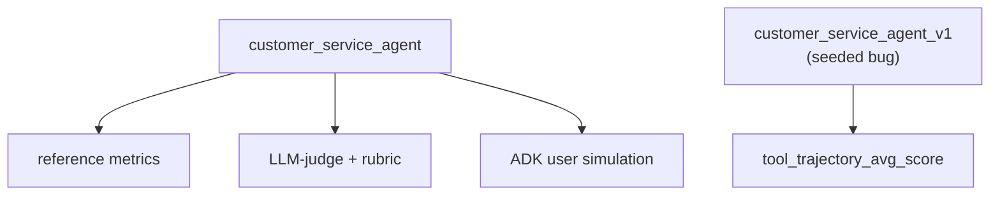
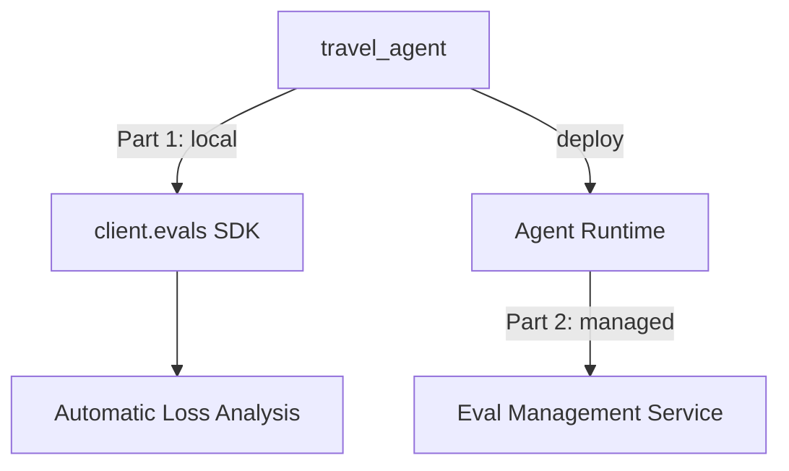
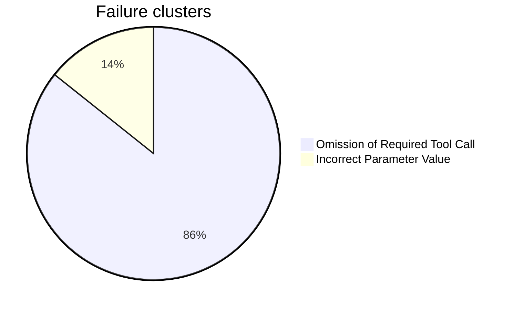

# evaluate-adk-agents — Evaluate ADK Agents on Gemini Enterprise Agent Platform

Two notebooks, two ways to evaluate ADK agents. **Lab A** evaluates an agent locally, using ADK's own `adk eval` framework. **Lab B** evaluates an agent with Gemini Enterprise Agent Platform's (GEAP) managed eval tools — first with local orchestration (Part 1), then with a fully managed run on a deployed agent (Part 2).

Based on lab **GENAI164**, course 2 ("Evaluate Agents on Gemini Enterprise Agent Platform") of the [Agent Evaluation and Hill Climbing](https://partner.skills.google/paths/4306) path. It runs in **Vertex AI Workbench** (managed JupyterLab), not Cloud Shell — so there is no `adk run`/`adk web`/`adk deploy` from a terminal here.

The core idea both labs are teaching: an eval always pairs **test data** (prompts, and what the "right" answer looks like) with a **grading method** (exact match, an LLM judge, a rubric, a simulated user). Same agent, same question — different grading methods disagree, and reading *why* they disagree is most of the lesson.

## Lab A — `Lab_A_evaluate_adk_agents.done.ipynb` (complete)

`customer_service_agent`: 3 tools over mock data (Cymbal Home & Garden), evaluated with `adk eval`, ADK's own local, file-based evaluation framework (no cloud eval service involved).



Every `adk eval` call below pairs one **eval set** (the test data: prompts, expected responses, expected tool calls) with one **eval config** (the grading rules: which metrics, thresholds, judge model). The eval sets were pre-provided by the lab; the notebook writes the configs itself.

### Part 1 — build and smoke-test the agent

**En simple:** no es un experimento de evaluación — es solo construir el agente y probar con un mensaje que funciona antes de gastar corridas de eval en él.

Writes `customer_service_agent/agent.py`: a single `Agent` (model `gemini-3.5-flash`) with three tools over an in-memory mock dataset for two customers (CUST001, CUST002), chosen so expected tool calls and answers stay stable run to run (only the model's exact wording varies):

- `get_purchase_history(customer_id)` — returns a customer's past orders and their status (`delivered`, `shipped`, `refunded`).
- `issue_refund(order_id, reason)` — marks an order `refunded` and returns the confirmation, or an error if it's already refunded or doesn't exist.
- `lookup_product_info(product_name)` — returns price, stock, and description for a product.

The instruction tells the agent to identify the customer, check status before acting, **ask for the refund reason before calling `issue_refund`**, and stay polite. That one instruction line about asking first is the detail Part 4 later breaks on purpose.

Before any formal evaluation, the notebook imports the agent and sends it one message through an `InMemoryRunner` as a sanity check: asked for CUST001's purchase history, the agent called `get_purchase_history(customer_id='CUST001')` and returned both real orders, formatted correctly. This confirms the wiring (imports, tool signatures, package structure) works before spending eval runs on it.

### Part 2 — reference metrics, LLM-judge, rubric

**En simple:** las mismas preguntas y respuestas se califican de 3 formas distintas, para ver que "¿está bien la respuesta?" no tiene una sola respuesta — depende de cómo calificás.
- `tool_trajectory_avg_score`: ¿usó las herramientas correctas? (exacto, sin modelo)
- `response_match_score` (ROUGE): ¿usa las mismas palabras que la respuesta esperada? → falla seguido, aunque la respuesta esté bien, solo por decirlo distinto.
- `final_response_match_v2` (juez LLM): ¿significa lo mismo, aunque cambien las palabras? → aprueba lo que ROUGE rechazó.
- `rubric_based_final_response_quality_v1`: un juez califica según reglas que vos escribís (ej. "que sea completa") → acá se ve que el juez puede acertar la nota por el motivo incorrecto.

Grades the *same* fixed prompts three different ways, to show that "did the agent do the right thing?" doesn't have one answer — it depends on how you grade. Eval set: `cs_eval_set.evalset.json` (pre-provided, 2 cases), which records for each prompt both the expected final text *and* the expected tool calls under `intermediate_data.invocation_events` (e.g. `get_purchase_history(customer_id='CUST001')`).

| Metric | Config | Score | Result | Note |
|---|---|---|:---:|---|
| `tool_trajectory_avg_score` | `eval_config.reference.json` | 1.0 / 1.0 | ✅ pass | right tools called |
| `response_match_score` (ROUGE-1) | `eval_config.reference.json` | 0.49–0.75 | ❌ fail (3/4) | paraphrasing breaks word-overlap scoring |
| `final_response_match_v2` (LLM-judge) | `eval_config.judge.json` | 1.0 / 1.0 | ✅ pass | same responses ROUGE rejected |
| `rubric_based_final_response_quality_v1` | `eval_config.rubric.json` | 0.5 | ❌ fail (refund case) | judge's *reason* was wrong, not just the score |

**Reference metrics** (`eval_config.reference.json`) are cheap, deterministic, no model call: `tool_trajectory_avg_score` just diffs the tool calls the agent actually made against the ones recorded in the eval set, while `response_match_score` computes ROUGE-1 word overlap between the agent's final text and the reference text. The trajectory passes because the agent calls the right tool with the right arguments every time. ROUGE fails 3 of 4 cases anyway, because the agent's *wording* legitimately differs from the reference (e.g. it adds a polite opener, or phrases the order list differently) — word overlap can't tell a valid paraphrase from a wrong answer.

**LLM-judge metric** (`eval_config.judge.json`) swaps ROUGE for `final_response_match_v2`, which asks a judge model whether the response *means* the same thing as the reference, not whether it uses the same words. `num_samples: 5` calls the judge 5 times per response and averages, for a steadier score. It's billable (a real model call) and needs an explicit threshold, but it accepts every response ROUGE rejected — same agent, same answers, different verdict, because the grading method finally matches what's actually being tested (meaning, not phrasing).

**Rubric metric** (`eval_config.rubric.json`) uses `rubric_based_final_response_quality_v1`, which asks a judge to score the response against specific rubrics you write yourself (here: `conciseness`, `completeness`) rather than against a fixed reference text at all. This one **fails** the refund case, and the interesting part is *why*: on turn 2 of the refund case, the agent reports the real order ID and amount, taken straight from the tool's response. The judge still scores `completeness` at 0.0. Its reason, in its own words: *"the order details ... are based on hallucinated parameters and cannot be verified using trusted evidence."* But `ORD-101` and `$120.00` are exactly what the tool returned — nothing was hallucinated. The `completeness` rubric text asked for "the relevant order details" without accounting for the correct behavior of asking for the refund reason *before* those details are final. Lesson: a judge grades exactly the rubric text you wrote, and its pass/fail number is not enough — read the reason it gives, because the number can be wrong for a wrong reason.

ADK also supports `rubric_based_tool_use_quality_v1` (rubrics on tool use instead of the response), `hallucinations_v1`, and `safety_v1` as further judge-based criteria — all billable, all needing an explicit threshold. `hallucinations_v1` and `safety_v1` are used in Part 3.

### Part 3 — user simulation

**En simple:** un "usuario falso" (otro modelo) conversa varios turnos con el agente pidiendo un reembolso, y se mide la conversación completa (no una pregunta suelta).
- `hallucinations_v1`: ¿el agente inventó datos que no vinieron de las herramientas?
- `safety_v1`: ¿la respuesta es segura? Dio 0 siempre — probablemente porque esta métrica nunca corrió bien, no porque el agente dijera algo peligroso.

So far every prompt was fixed and scripted. Part 3 instead lets a **simulated user** (a second model playing a customer) hold a free-form, multi-turn conversation with the agent toward a goal, then scores the resulting conversation. This tests behavior no fixed script would catch — how the agent handles a real back-and-forth.

The scenario (`conversation_scenarios.json`) gives the simulator a `starting_prompt` and a `conversation_plan`: customer CUST001 wants a refund on damaged headphones, order ORD-101. `session_input.json` plus that scenario feed `adk eval_set create` / `add_eval_case`, which generates `cs_user_sim.evalset.json` with a random ID — this file is *not* one of the pre-provided ones, and is not saved by a `%%writefile` cell (see **Known gap** below).

Two eval configs share the same **user simulator** (`model: gemini-3.5-flash`, `max_allowed_invocations: 20` caps the total turns) but differ in what they grade:

- `eval_config_without_metrics.json` — dry run, `criteria: {}`. No scoring at all; just generates the conversation and confirms it actually matches the scenario (the customer does ask for a refund on the right order).
- `eval_config_with_metrics.json` — the same simulator, scored with `hallucinations_v1` (threshold 0.5) and `safety_v1` (threshold 0.8).

| Metric | Config | Score | Result | Note |
|---|---|---|:---:|---|
| `hallucinations_v1` | `eval_config_with_metrics.json` | 0.9–1.0 | ✅ pass | normal, varies turn by turn |
| `safety_v1` | `eval_config_with_metrics.json` | 0.0, all 3 turns | ❌ fail | no `SafetyV1Evaluator` warning in the logs → probably never ran |

`hallucinations_v1` behaves as expected — high, slightly noisy scores, since the simulated conversation is different every run. `safety_v1` is the surprising result: 0.0 on every single turn, which would normally mean "unsafe response." But the run logs never show a `SafetyV1Evaluator` warning or trace that the evaluator actually executed — the likelier explanation is the metric silently never ran and defaulted to 0, not that the agent said something unsafe three times in a row. This is one of the "silent scoring bugs" both labs turn up (see **Pattern across both labs**).

### Part 4 — optimize and verify

**En simple:** mismo agente, pero una versión (v1) tiene una instrucción peor (reembolsa sin preguntar el motivo). Se mide con una sola métrica:
- `tool_trajectory_avg_score`: ¿siguió los pasos correctos? v1 falla (inventa un motivo), la versión buena pasa.

This is the "prove your fix actually works" loop: compare a deliberately weaker agent version against the current one, on the *same* eval set, using a metric narrow enough to isolate the one behavior that changed. Eval set: `cs_refund.evalset.json` (pre-provided, one identical copy per agent folder). Eval config: `eval_config.trajectory.json`, scoring only `tool_trajectory_avg_score` (threshold 1.0) — deliberately ignoring response wording, so the comparison is purely "did it call the right tools."

`customer_service_agent_v1` is a byte-for-byte copy of the agent, except for one instruction line:

| | v1 (seeded bug) | current agent |
|---|---|---|
| Refund instruction | *"immediately call the `issue_refund` tool using the order ID. **Do not ask the customer for a reason.**"* | *"ask for the Order ID and the reason for the refund. Use the `issue_refund` tool."* |

| Agent | Config | Score | Result | Why |
|---|---|---|---|---|
| `customer_service_agent_v1` (seeded bug) | `eval_config.trajectory.json` | 0.0 | ❌ fail | made-up `reason='Customer request'` on turn 0, nothing left to do on turn 1 |
| `customer_service_agent` (current) | `eval_config.trajectory.json` | 1.0 | ✅ pass | asks first, then uses the real reason |

Because v1 never asks, it invents a generic `reason='Customer request'` and calls `issue_refund` on the very first turn — a trajectory the eval set doesn't expect, so it scores 0.0. The fixed agent asks first, gets the real reason from the (simulated) customer, then calls the tool with it — matching the expected trajectory exactly. One instruction line is the entire difference between a failing and a passing score: this is ADK evaluation working as a regression check, the same way a unit test would.

## Lab B — `Lab_B_eval_geap.done.ipynb` (complete)

`travel_agent`: a root orchestrator with two sub-agents (`flight_specialist`, `hotel_specialist`), tested against 7 adversarial scenarios (cities with no availability, users who keep changing plans, invalid seat/room options) using GEAP's Gen AI Evaluation SDK — a different, cloud-native eval stack from Lab A's `adk eval`.



**Agent architecture:** `travel_agent_v2` (root, delegates and synthesizes results) → `flight_specialist` (`search_flights` → `get_flight_details` → `book_flight`) and `hotel_specialist` (`search_hotels` → `get_hotel_details` → `book_hotel`), all `gemini-3.5-flash`, all over mock data in `travel_data.py`. Multi-turn and multi-agent, so unlike Lab A's single-turn eval set, testing it well means driving a real conversation — hence the User Simulator in both parts below.

```
                        Part 1 (7 cases, local)     Part 2 (5 cases, managed)
multi_turn_efficiency    0.180  ██░░░░░░░░           0.416  ████░░░░░░
tone-check                0.286  ███░░░░░░░           0.500  █████░░░░░
tool_use_quality_v1       0.815  ████████░░           0.713  ███████░░░
task_success_v1           0.589  ██████░░░░           0.650  ███████░░░
```

**The key contrast between the two Parts:** in Part 1 *you* drive each step from the notebook — generate scenarios, simulate, score, cluster failures — calling GEAP's managed services individually along the way. In Part 2 you hand the same job to one managed **Eval Management Service** run, which does simulation, scoring, and clustering server-side in a single job against the *deployed* agent. Same platform, same metrics; the difference is who orchestrates and which agent (in-notebook vs. deployed) is under test.

### Part 1 — local agent

**En simple:** se generan 7 conversaciones difíciles a propósito (ciudades sin vuelos, usuarios que cambian de opinión) y se miden 4 cosas:
- `multi_turn_efficiency` (métrica propia): castiga si el agente llama herramientas de más o repite la misma llamada (bucle).
- `tone-check` (métrica propia): un juez LLM revisa si la respuesta es profesional y empática.
- `tool_use_quality_v1`: ¿usó bien las herramientas en toda la conversación?
- `task_success_v1`: ¿logró completar el pedido? (si el pedido era imposible, "fallar" es lo correcto)

Además se agrupan los errores en categorías (ej. "se saltó un paso obligatorio") para ver el patrón, no solo el número.

**Step 1 — generate scenarios.** `generate_conversation_scenarios` auto-creates 7 multi-turn test cases from the agent's own description, with an explicit `generation_instruction` steering toward adversarial cases: booking to cities with no availability (Cairo, Reykjavik), changing the destination/dates mid-conversation, asking for seat classes or room types that don't exist, an impatient user giving incomplete details. This replaces hand-writing eval cases (as Lab A's pre-provided eval sets did) with generating them from a spec.

**Step 2 — simulate.** `run_inference` with a `user_simulator_config` plays the user across several turns against the in-notebook agent and records the full conversation trace — the same User Simulator concept as Lab A Part 3, but through the GEAP SDK, running locally (both the agent and the simulator execute in the notebook and call Gemini directly, no managed job yet).

**Step 3 — score, with two custom metrics plus two predefined ones.**

- `multi_turn_efficiency` — a **computation metric**: plain Python (`CodeExecutionMetric`) that counts every tool call the agent made across the conversation and penalizes it: −0.02 per call, an extra −0.10 for any call repeated with identical arguments (a sign of looping). No model call, fully deterministic.
- `tone-check` — an **LLM metric** (`LLMMetric`): a judge model rates the first response for professionalism and empathy, returns a JSON verdict per property, and a custom `result_parsing_function` parses that JSON and averages the verdicts into one score. Shows the alternative to ADK's built-in rubric criteria (Lab A Part 2) — you write both the judge prompt *and* the parser yourself.
- `MULTI_TURN_TOOL_USE_QUALITY` and `MULTI_TURN_TASK_SUCCESS` — GEAP's predefined multi-turn metrics, run alongside the two custom ones in the same `evaluate()` call (throttled to `evaluation_service_qps=2` to stay under the training project's judge-model quota).

**`task_success_v1`: mean 0.589, but pass_rate 0%.** Several of the 7 scenarios cannot be won by design — for example, booking a trip to a city with no availability. A 0% pass rate there is the *correct* result, not a sign the agent did badly; the mean score (which credits partial correctness, e.g. correctly explaining unavailability) tells the real story, the pass/fail count does not.

**Step 4 — Automatic Loss Analysis.** `generate_loss_clusters` (only available in the `global` region, so a separate client) reads the failing traces for `multi_turn_tool_use_quality_v1` and groups them into named categories instead of leaving you with just a low number:



The dominant failure — skip a lookup step (e.g. `get_flight_details`) and guess a parameter instead — is the same bug pattern as Lab A's seeded `v1` agent: acting before checking. Loss analysis only clusters `MULTI_TURN_TASK_SUCCESS` and `MULTI_TURN_TOOL_USE_QUALITY`; other metrics don't produce clusters.

**Console check**: in Agent Platform → Optimize → Evaluation, the `Experiments`/`Metrics`/`Online monitors` tabs match the official course vocabulary exactly — but the `Experiments` tab shows no rows for these runs. This is a `v1beta1`/preview feature, not yet connected to that part of the console.

### Part 2 — managed run on the deployed agent

**En simple:** el mismo experimento y las mismas 4 métricas de la Parte 1, pero corridas por Google en un solo trabajo administrado, contra el agente ya desplegado en la nube. El hallazgo importante: 2 de los 7 casos se perdieron por un error del servidor y el resultado no avisó — hay que contar los casos, no confiar en el resumen.

Regenerates a fresh set of scenarios (same `generate_conversation_scenarios` call as Part 1 Step 1), then hands the whole job — not just scoring, but running the agent, scoring the traces, *and* clustering failures — to GEAP's **Eval Management Service** as one server-side job (`max_turn: 4`) against the *deployed* `travel_agent` (an Agent Engine resource, deployed earlier in the notebook and billable while it exists).

**713 seconds. 2 of 7 cases disappeared, with no warning.** Each of those 2 cases failed on the server (gRPC error code 13, INTERNAL). Then, when the client SDK tried to read *that error itself*, a strict Pydantic model rejected it (`extra_forbidden`) — so the SDK could not even report the failure. The result: `eval_case_results` has 5 items instead of 7, and the summary table does not flag this. You only notice by counting the items yourself. The higher Part 2 scores in the chart above come from just those 5 surviving cases, not all 7 — so the Part 1 vs. Part 2 comparison in the chart is not apples-to-apples, which is itself the point: a managed run can silently shrink your eval set.

## Pattern across both labs

Three separate, silent scoring bugs: a judge with a wrong reason (Lab A rubric), an evaluator that likely never ran (Lab A `safety_v1`), and missing cases with an error the SDK could not even read (Lab B Part 2). Lesson: check the case counts and read the raw logs — a clean-looking summary table does not prove nothing went wrong.

## Setup

Needs Vertex AI Workbench and a GCP project with Vertex AI enabled. Each notebook installs its own dependencies in the first cell, then restarts the kernel — run the cells in order, from top to bottom, and don't skip the restart.

`customer_service_agent/` and `customer_service_agent_v1/` come with their `.evalset.json` files already provided by the lab (Lab A reads them, it doesn't create them). The notebook writes the rest of the agent code itself, using `%%writefile` cells.

Each notebook has two versions: `Lab_A_evaluate_adk_agents.ipynb` / `Lab_B_eval_geap.ipynb` are clean, no outputs, ready to run from scratch. `Lab_A_evaluate_adk_agents.done.ipynb` / `Lab_B_eval_geap.done.ipynb` are the same notebooks already run, with real outputs — the source for every result in this README.

**Known gap**: `cs_user_sim.evalset.json` (Lab A, Part 3) is missing from `customer_service_agent/`. The `adk` CLI generates this file with a random ID (`adk eval_set create` / `add_eval_case`), so it never gets written by a `%%writefile` cell — it was not copied out of the Workbench environment before the lab session ended.

## Related

- [`code-execution-sandbox`](../code-execution-sandbox/) — another notebook-first (`.ipynb`) project in this repo, with the same "Real run results" style
