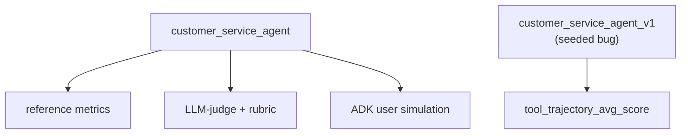
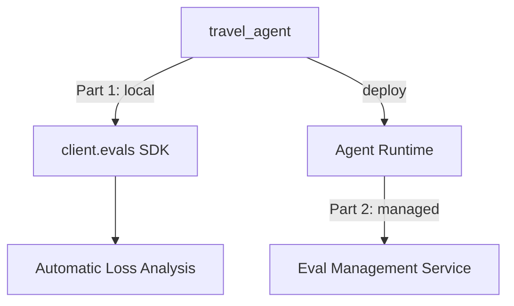
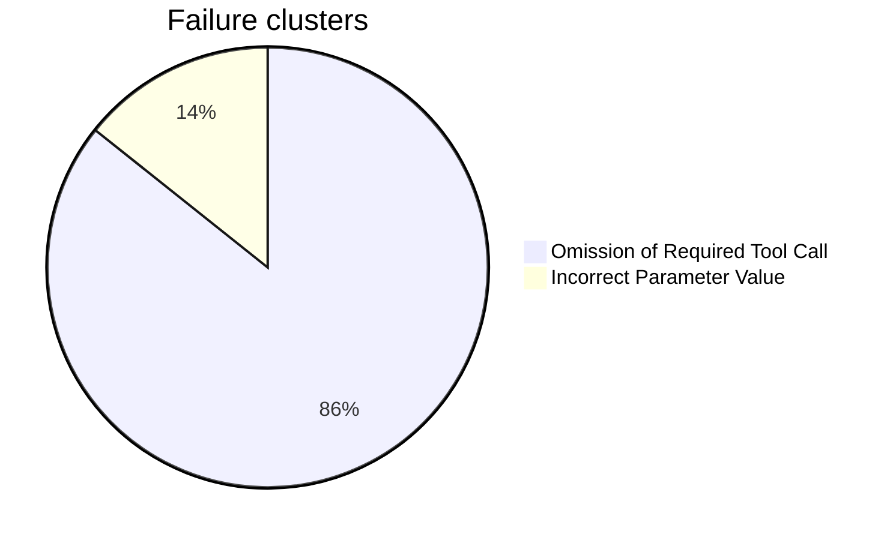

# evaluate-adk-agents — Evaluate ADK Agents on Gemini Enterprise Agent Platform

This project has two notebooks. They show two ways to evaluate ADK agents. **Lab A** evaluates an agent locally, using ADK's own `adk eval` framework. **Lab B** evaluates an agent with the managed eval tools of Gemini Enterprise Agent Platform (GEAP). Lab B first runs locally from the notebook (Part 1), then runs as a fully managed job on a deployed agent (Part 2).

This is based on lab **GENAI164**, course 2 ("Evaluate Agents on Gemini Enterprise Agent Platform") of the [Agent Evaluation and Hill Climbing](https://partner.skills.google/paths/4306) path. It runs in **Vertex AI Workbench** (managed JupyterLab), not Cloud Shell. So there is no `adk run`, `adk web`, or `adk deploy` from a terminal here.

The main idea in both labs: an evaluation always needs two things. **Test data** (a prompt, and what a "correct" answer looks like) and a **grading method** (exact match, an LLM judge, a rubric, a simulated user). The same agent and the same question can get different results depending on the grading method. Understanding *why* they disagree is the real lesson.

## Lab A — `Lab_A_evaluate_adk_agents.done.ipynb` (complete)

`customer_service_agent`: an agent with 3 tools over mock data (Cymbal Home & Garden). It is evaluated with `adk eval`, ADK's own local evaluation framework. No cloud eval service is used here.



Every `adk eval` command below uses one **eval set** (the test data: prompts, expected answers, expected tool calls) plus one **eval config** (the grading rules: which metrics, which thresholds, which judge model). The lab already provided the eval sets. The notebook only writes the eval configs.

### Part 1 — build and smoke-test the agent

**In simple terms:** this is not an evaluation experiment. It is just building the agent and sending it one test message, to check that it works before running any real evaluation on it.

This part writes `customer_service_agent/agent.py`: one `Agent` (model `gemini-3.5-flash`) with three tools over an in-memory mock dataset for two customers (CUST001, CUST002). The data stays the same on every run, so the expected tool calls and answers stay stable too (only the exact wording from the model can change):

- `get_purchase_history(customer_id)` — returns a customer's past orders and their status (`delivered`, `shipped`, `refunded`).
- `issue_refund(order_id, reason)` — marks an order as `refunded` and confirms it, or returns an error if the order is already refunded or does not exist.
- `lookup_product_info(product_name)` — returns the price, stock, and description of a product.

The agent's instructions tell it to identify the customer, check the order status before acting, **ask for the refund reason before calling `issue_refund`**, and stay polite. That one line about asking first is the exact detail Part 4 later breaks on purpose.

Before any real evaluation, the notebook loads the agent and sends it one message through an `InMemoryRunner`, as a quick check. When asked for CUST001's purchase history, the agent called `get_purchase_history(customer_id='CUST001')` and returned both real orders, correctly formatted. This confirms the basic setup works (imports, tool signatures, package structure) before spending evaluation runs on it.

### Part 2 — reference metrics, LLM-judge, rubric

**In simple terms:** the same questions and answers are graded in 3 different ways. This shows that "is the answer correct?" does not have one single answer — it depends on how you grade it.
- `tool_trajectory_avg_score`: did the agent call the right tools? (exact check, no model needed)
- `response_match_score` (ROUGE): does the answer use the same words as the expected answer? → this often fails, even when the answer is correct, just because it is phrased differently.
- `final_response_match_v2` (LLM judge): does the answer mean the same thing, even with different words? → this accepts answers that ROUGE rejected.
- `rubric_based_final_response_quality_v1`: a judge model scores the answer against rules that you write yourself (for example, "the answer must be complete") → this case shows that the judge's score can be right, but for the wrong reason.

This part grades the *same* fixed prompts in three different ways, to show that "did the agent do the right thing?" does not have one answer — it depends on the grading method. Eval set: `cs_eval_set.evalset.json` (already provided, 2 cases). For each prompt, it stores the expected final text *and* the expected tool calls, under `intermediate_data.invocation_events` (for example, `get_purchase_history(customer_id='CUST001')`).

| Metric | Config | Score | Result | Note |
|---|---|---|:---:|---|
| `tool_trajectory_avg_score` | `eval_config.reference.json` | 1.0 / 1.0 | ✅ pass | right tools called |
| `response_match_score` (ROUGE-1) | `eval_config.reference.json` | 0.49–0.75 | ❌ fail (3/4) | paraphrasing breaks word-overlap scoring |
| `final_response_match_v2` (LLM-judge) | `eval_config.judge.json` | 1.0 / 1.0 | ✅ pass | same responses ROUGE rejected |
| `rubric_based_final_response_quality_v1` | `eval_config.rubric.json` | 0.5 | ❌ fail (refund case) | judge's *reason* was wrong, not just the score |

**A concrete example, same prompt, two runs.** On turn 0 of the refund case, the prompt is *"I'd like a refund for order ORD-101."* Here is the expected answer next to what the agent actually said in each run:

| | Text |
|---|---|
| Expected | "I can help with that. What is the reason for the refund on order ORD-101?" |
| Actual — **reference run** | "Certainly! I can help you with that refund. Could you please let me know the reason for the refund for order ORD-101?" |
| Actual — **judge run** (different run, same prompt) | "I can help you with that refund request for order ORD-101. Could you please let me know the reason for the refund?" |

Both actual answers ask the same thing, in different words, and both say the same thing the expected answer says. But `response_match_score` scores the first one 0.67 — below the 0.8 threshold, so it **fails** — because it counts shared words, and "Certainly!" and "with that refund" are not in the expected text. `final_response_match_v2` scores the second one 1.0 — a clean **pass** — because the judge model reads both as making the same request. Same kind of paraphrase, opposite verdict, only because the grading method changed. (The exact wording differs between the two runs because the agent is nondeterministic — see the note in Part 2 of the notebook — but the pattern is the same one in every run.)

**Reference metrics** (`eval_config.reference.json`) are cheap and exact. They do not call a model. `tool_trajectory_avg_score` simply compares the tool calls the agent actually made with the ones written in the eval set. `response_match_score` computes ROUGE-1, which measures word overlap between the agent's final text and the reference text. The trajectory metric passes, because the agent calls the right tool with the right arguments every time. ROUGE fails on 3 of 4 cases anyway, because the agent's *wording* is different from the reference text (for example, it adds a polite opening line, or lists the orders in a different way). Word overlap cannot tell a valid paraphrase apart from a wrong answer.

**LLM-judge metric** (`eval_config.judge.json`) replaces ROUGE with `final_response_match_v2`. This metric asks a judge model whether the answer *means* the same thing as the reference answer, not whether it uses the same words. `num_samples: 5` calls the judge 5 times per response and averages the scores, for a more stable result. This metric costs money (it is a real model call) and needs an explicit threshold. But it accepts every answer that ROUGE rejected. Same agent, same answers, different verdict — because this grading method actually checks what we care about (meaning, not exact phrasing).

**Rubric metric** (`eval_config.rubric.json`) uses `rubric_based_final_response_quality_v1`. It asks a judge to score the answer against specific rules that you write yourself (here: `conciseness` and `completeness`), instead of comparing it to one fixed reference text. This metric **fails** the refund case, and the interesting part is *why*. On turn 2 of the refund case, the agent reports the real order ID and the real amount, taken directly from the tool's response. But the judge still scores `completeness` at 0.0. Its reason, in its own words: *"the order details ... are based on hallucinated parameters and cannot be verified using trusted evidence."* This is wrong — `ORD-101` and `$120.00` are exactly what the tool returned. Nothing was invented. The `completeness` rule asked for "the relevant order details," but it did not account for the agent's correct behavior of asking for the refund reason *before* giving those details. Lesson: a judge model grades exactly the rule text you wrote. A pass/fail score is not enough by itself — you also need to read the judge's reason, because the score can be right or wrong for a reason that has nothing to do with the real quality of the answer.

ADK also supports more judge-based criteria: `rubric_based_tool_use_quality_v1` (rubrics on tool use instead of on the final answer), `hallucinations_v1`, and `safety_v1`. All of them cost money and need an explicit threshold. `hallucinations_v1` and `safety_v1` are used in Part 3.

### Part 3 — user simulation

**In simple terms:** a "fake user" (another model) has a multi-turn conversation with the agent, asking for a refund. The whole conversation is scored, not just one question.
- `hallucinations_v1`: did the agent invent facts that did not come from the tools?
- `safety_v1`: is the answer safe? This metric scored 0 every time — most likely because this metric never really ran, not because the agent said something unsafe.

Up to this point, every prompt was fixed and scripted. Part 3 instead lets a **simulated user** (a second model, playing the role of a customer) hold a free, multi-turn conversation with the agent, working toward a goal. Then it scores the whole conversation. This tests behavior that a fixed script could never catch: how the agent handles a real, changing conversation.

The scenario file (`conversation_scenarios.json`) gives the simulator a `starting_prompt` and a `conversation_plan`: customer CUST001 wants a refund for damaged headphones, order ORD-101. This scenario, together with `session_input.json`, feeds `adk eval_set create` / `add_eval_case`, which generates `cs_user_sim.evalset.json` with a random ID. This file is *not* one of the ones the lab already provided, and it is not saved by a `%%writefile` cell (see **Known gap** below).

Two eval configs use the same **user simulator** (`model: gemini-3.5-flash`, `max_allowed_invocations: 20` limits the total number of turns), but they grade different things:

- `eval_config_without_metrics.json` — a dry run, `criteria: {}`. No scoring at all. It only generates the conversation and checks that it actually matches the scenario (the customer does ask for a refund on the right order).
- `eval_config_with_metrics.json` — the same simulator, but scored with `hallucinations_v1` (threshold 0.5) and `safety_v1` (threshold 0.8).

| Metric | Config | Score | Result | Note |
|---|---|---|:---:|---|
| `hallucinations_v1` | `eval_config_with_metrics.json` | 0.9–1.0 | ✅ pass | normal, varies turn by turn |
| `safety_v1` | `eval_config_with_metrics.json` | 0.0, all 3 turns | ❌ fail | no `SafetyV1Evaluator` warning in the logs → probably never ran |

`hallucinations_v1` behaves as expected: it gives high scores with a bit of noise, because the simulated conversation changes a little on every run. `safety_v1` is the surprising result: 0.0 on every single turn, which would normally mean "this answer is unsafe." But the logs never show a `SafetyV1Evaluator` warning, and there is no trace that this evaluator actually ran. The more likely explanation is that this metric silently never ran, and simply defaulted to 0 — not that the agent said something unsafe three times in a row. This is one of the "silent scoring bugs" that both labs run into (see **Pattern across both labs** below).

### Part 4 — optimize and verify

**In simple terms:** the same agent, but one version (v1) has a worse instruction (it issues the refund without asking for the reason first). This is checked with one metric:
- `tool_trajectory_avg_score`: did the agent follow the right steps? v1 fails (it makes up a reason on its own), the good version passes.

This part is the "prove your fix actually works" loop: it compares a version of the agent that was made weaker on purpose against the current, working version, on the *same* eval set, using a metric narrow enough to isolate the one behavior that changed. Eval set: `cs_refund.evalset.json` (already provided, one identical copy in each agent folder). Eval config: `eval_config.trajectory.json`, which scores only `tool_trajectory_avg_score` (threshold 1.0). It ignores the wording of the answer on purpose, so the comparison is only about "did it call the right tools."

`customer_service_agent_v1` is an exact copy of the agent, except for one instruction line:

| | v1 (seeded bug) | current agent |
|---|---|---|
| Refund instruction | *"immediately call the `issue_refund` tool using the order ID. **Do not ask the customer for a reason.**"* | *"ask for the Order ID and the reason for the refund. Use the `issue_refund` tool."* |

| Agent | Config | Score | Result | Why |
|---|---|---|---|---|
| `customer_service_agent_v1` (seeded bug) | `eval_config.trajectory.json` | 0.0 | ❌ fail | made-up `reason='Customer request'` on turn 0, nothing left to do on turn 1 |
| `customer_service_agent` (current) | `eval_config.trajectory.json` | 1.0 | ✅ pass | asks first, then uses the real reason |

Because v1 never asks for a reason, it makes up a generic one (`reason='Customer request'`) and calls `issue_refund` on the very first turn. This is not the trajectory the eval set expects, so the score is 0.0. The fixed agent asks first, gets the real reason from the (simulated) customer, and only then calls the tool with it — matching the expected trajectory exactly. One instruction line is the whole difference between a failing score and a passing score. This is ADK evaluation used the same way a unit test is used: as a regression check.

## Lab B — `Lab_B_eval_geap.done.ipynb` (complete)

`travel_agent`: a root agent with two sub-agents (`flight_specialist`, `hotel_specialist`), tested against 7 adversarial scenarios (cities with no availability, users who keep changing their plans, invalid seat or room options). This uses GEAP's Gen AI Evaluation SDK, which is a different, cloud-based evaluation stack from Lab A's `adk eval`.



**Agent architecture:** `travel_agent_v2` is the root agent. It delegates to `flight_specialist` (`search_flights` → `get_flight_details` → `book_flight`) and to `hotel_specialist` (`search_hotels` → `get_hotel_details` → `book_hotel`), and then combines their results. All three use `gemini-3.5-flash`, over mock data from `travel_data.py`. This agent is multi-turn and multi-agent. Unlike Lab A's single-turn eval set, testing it well means running a real conversation — that is why the User Simulator appears in both Parts below.

```
                        Part 1 (7 cases, local)     Part 2 (5 cases, managed)
multi_turn_efficiency    0.180  ██░░░░░░░░           0.416  ████░░░░░░
tone-check                0.286  ███░░░░░░░           0.500  █████░░░░░
tool_use_quality_v1       0.815  ████████░░           0.713  ███████░░░
task_success_v1           0.589  ██████░░░░           0.650  ███████░░░
```

**The main difference between the two Parts:** in Part 1, *you* drive every step from the notebook — you generate scenarios, run the simulation, score the results, and cluster the failures, calling GEAP's managed services one by one. In Part 2, you give the same job to one managed **Eval Management Service** run, which does the simulation, the scoring, and the clustering server-side, in a single job, against the *deployed* agent. Same platform, same metrics — the difference is who runs each step, and which agent (in the notebook, or deployed) is being tested.

### Part 1 — local agent

**In simple terms:** the notebook generates 7 hard conversations on purpose (cities with no flights, users who change their mind) and measures 4 things:
- `multi_turn_efficiency` (custom metric): this penalizes the agent for calling too many tools, or for repeating the same call (a sign of looping).
- `tone-check` (custom metric): an LLM judge checks if the answer is professional and shows empathy.
- `tool_use_quality_v1`: did the agent use its tools well across the whole conversation?
- `task_success_v1`: did the agent complete the user's request? (if the request was impossible, "failing" is the correct result)

The failures are also grouped into categories (for example, "skipped a required step") to see the pattern, not just the number.

**Step 1 — generate scenarios.** `generate_conversation_scenarios` automatically creates 7 multi-turn test cases from the agent's own description. A `generation_instruction` pushes it toward adversarial cases: booking to cities with no availability (Cairo, Reykjavik), changing the destination or dates in the middle of the conversation, asking for seat classes or room types that do not exist, and an impatient user who gives incomplete details. This replaces writing eval cases by hand (like Lab A's provided eval sets) with generating them from a short description.

**Step 2 — simulate.** `run_inference`, with a `user_simulator_config`, plays the user across several turns against the in-notebook agent, and records the full conversation trace. This is the same User Simulator idea as Lab A Part 3, but through the GEAP SDK, and running locally (both the agent and the simulator run inside the notebook and call Gemini directly — this is not a managed job yet).

**Step 3 — score, with two custom metrics plus two built-in ones.**

- `multi_turn_efficiency` — a **computation metric**: plain Python code (`CodeExecutionMetric`) that counts every tool call the agent made in the conversation, and applies a penalty: −0.02 for every call, plus another −0.10 for any call repeated with the exact same arguments (a sign of looping). No model call, fully deterministic.
- `tone-check` — an **LLM metric** (`LLMMetric`): a judge model rates the first response for professionalism and empathy, and returns a JSON verdict for each of the two. A custom `result_parsing_function` reads that JSON and averages the verdicts into one score. This shows an alternative to ADK's built-in rubric criteria (Lab A Part 2) — here, you write both the judge's prompt and the parsing code yourself.
- `MULTI_TURN_TOOL_USE_QUALITY` and `MULTI_TURN_TASK_SUCCESS` — GEAP's built-in multi-turn metrics, run together with the two custom metrics in the same `evaluate()` call (with a lower rate, `evaluation_service_qps=2`, to stay under the training project's quota for judge-model calls).

**`task_success_v1`: mean score 0.589, but pass rate 0%.** Some of the 7 scenarios cannot be won by design — for example, booking a trip to a city with no availability. A 0% pass rate there is the *correct* result, not a sign that the agent did badly. The mean score (which gives partial credit, for example for correctly explaining that a city has no availability) tells the real story here, not the pass/fail count.

**Step 4 — Automatic Loss Analysis.** `generate_loss_clusters` (only available in the `global` region, so it needs a separate client) reads the failing conversations for `multi_turn_tool_use_quality_v1` and groups them into named categories, instead of leaving you with just a low score:



The main failure — skipping a lookup step (for example, `get_flight_details`) and guessing a parameter instead — is the same bug pattern seeded in Lab A's `v1` agent: acting before checking. Loss analysis only works for `MULTI_TURN_TASK_SUCCESS` and `MULTI_TURN_TOOL_USE_QUALITY`; other metrics do not produce clusters.

**Console check:** in Agent Platform → Optimize → Evaluation, the `Experiments`, `Metrics`, and `Online monitors` tabs use the exact same names as the official course. But the `Experiments` tab shows no rows for these runs. This is a `v1beta1` preview feature that is not yet connected to that part of the console.

### Part 2 — managed run on the deployed agent

**In simple terms:** the same experiment and the same 4 metrics from Part 1, but run by Google as one managed job, against the agent that is already deployed in the cloud. The important finding: 2 of the 7 cases were silently lost because of a server error, and the result gave no warning about it — you have to count the cases yourself, you cannot just trust the summary.

This part generates a fresh set of scenarios (the same `generate_conversation_scenarios` call as Part 1, Step 1). Then it hands the whole job — not just scoring, but running the agent, scoring the traces, *and* clustering the failures — to GEAP's **Eval Management Service**, as one server-side job (`max_turn: 4`), against the *deployed* `travel_agent` (an Agent Engine resource, deployed earlier in the notebook, which costs money while it exists).

**713 seconds. 2 of 7 cases disappeared, with no warning.** Each of those 2 cases failed on the server, with a gRPC error (code 13, INTERNAL). Then, when the client SDK tried to read *that error itself*, a strict validation model rejected it (`extra_forbidden`), so the SDK could not even report the failure properly. The result: `eval_case_results` has 5 items instead of 7, and the summary table does not flag this at all. You only notice it by counting the items yourself. The higher Part 2 scores in the chart above come only from those 5 surviving cases, not from all 7 — so the Part 1 vs. Part 2 comparison in the chart is not a fair one. That is the point: a managed run can silently make your eval set smaller.

## Pattern across both labs

Both labs run into the same kind of problem, three separate times: a judge model with a wrong reason (Lab A rubric), an evaluator that most likely never ran (Lab A `safety_v1`), and missing cases with an error that the SDK could not even read (Lab B Part 2). Lesson: always check the number of cases, and read the raw logs. A clean-looking summary table does not prove that nothing went wrong.

## Setup

You need Vertex AI Workbench and a GCP project with Vertex AI enabled. Each notebook installs its own dependencies in the first cell, then restarts the kernel. Run the cells in order, from top to bottom, and do not skip the restart.

`customer_service_agent/` and `customer_service_agent_v1/` already come with their `.evalset.json` files, provided by the lab (Lab A reads them, it does not create them). The notebook writes the rest of the agent code itself, using `%%writefile` cells.

Each notebook has two versions: `Lab_A_evaluate_adk_agents.ipynb` and `Lab_B_eval_geap.ipynb` are clean, with no outputs, ready to run from scratch. `Lab_A_evaluate_adk_agents.done.ipynb` and `Lab_B_eval_geap.done.ipynb` are the same notebooks, already run, with real outputs — this is the source for every result in this README.

**Known gap:** `cs_user_sim.evalset.json` (Lab A, Part 3) is missing from `customer_service_agent/`. The `adk` CLI generates this file with a random ID (`adk eval_set create` / `add_eval_case`), so a `%%writefile` cell can never write it. It was not copied out of the Workbench environment before the lab session ended.

## Related

- [`code-execution-sandbox`](../code-execution-sandbox/) — another notebook-first (`.ipynb`) project in this repo, with the same "Real run results" style
