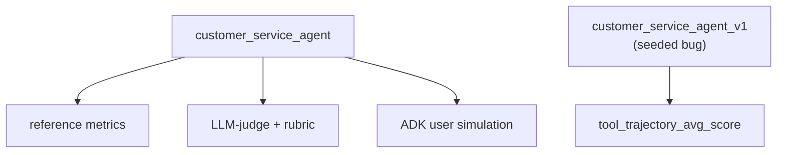
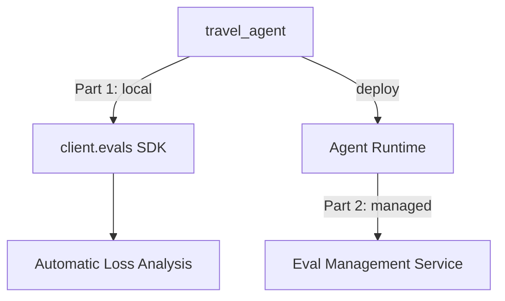
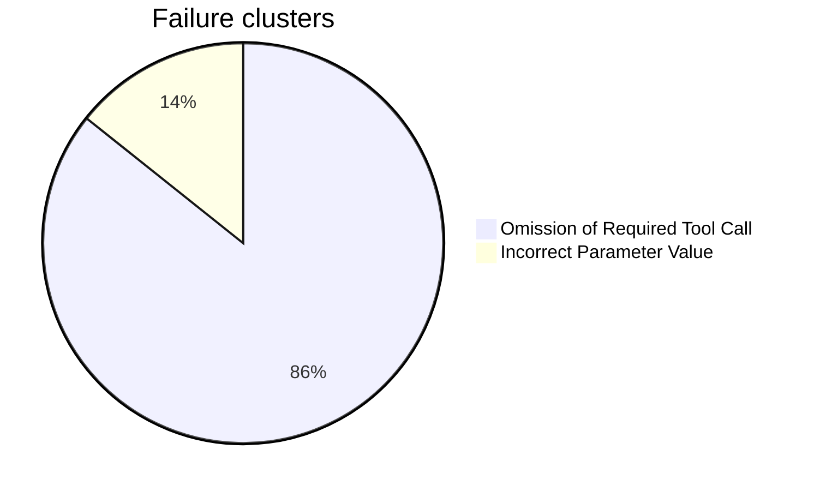

# evaluate-adk-agents — Evaluate ADK Agents on Gemini Enterprise Agent Platform

Two notebooks, two ways to evaluate ADK agents. **Lab A** evaluates an agent locally, using ADK's own `adk eval` framework. **Lab B** evaluates an agent with Gemini Enterprise Agent Platform's (GEAP) managed eval tools — first with local orchestration (Part 1), then with a fully managed run on a deployed agent (Part 2).

Based on lab **GENAI164**, course 2 ("Evaluate Agents on Gemini Enterprise Agent Platform") of the [Agent Evaluation and Hill Climbing](https://partner.skills.google/paths/4306) path. It runs in **Vertex AI Workbench** (managed JupyterLab), not Cloud Shell — so there is no `adk run`/`adk web`/`adk deploy` from a terminal here.

## Lab A — `Lab_A_evaluate_adk_agents.ipynb` (complete)

`customer_service_agent`: 3 tools over mock data (Cymbal Home & Garden), evaluated with `adk eval`.



Every `adk eval` call below pairs one **eval set** (the test data: prompts, expected responses, expected tool calls) with one **eval config** (the grading rules: which metrics, thresholds, judge model). The eval sets were pre-provided by the lab; the notebook writes the configs itself.

### Part 1 — build and smoke-test the agent

Writes `customer_service_agent/agent.py` (3 tools: `get_purchase_history`, `issue_refund`, `lookup_product_info`) and sends it one message through an `InMemoryRunner`, before any formal evaluation. Confirms the wiring works: asked for CUST001's purchase history, the agent called `get_purchase_history(customer_id='CUST001')` and returned both real orders, formatted correctly.

### Part 2 — reference metrics, LLM-judge, rubric

Grades the same fixed prompts three ways: exact match, an LLM judge, and a custom rubric. Eval set: `cs_eval_set.evalset.json` (pre-provided).

| Metric | Config used | Result | Finding |
|---|---|---|---|
| `tool_trajectory_avg_score` | `eval_config.reference.json` | 1.0 / 1.0 | the agent called the right tools |
| `response_match_score` (ROUGE-1) | `eval_config.reference.json` | fails 3/4 | paraphrasing breaks this word-overlap score |
| `final_response_match_v2` (LLM-judge) | `eval_config.judge.json` | 1.0 / 1.0, same responses | shows the gap between reference metrics and judge metrics |
| `rubric_based_final_response_quality_v1` | `eval_config.rubric.json` | 0.5 on the refund case | the judge called tool data "hallucinated" — **a wrong reason, not just a low score** |

**A wrong judge reason, in its own words**: on turn 2 of the refund case, the agent reports the real order ID and amount, taken straight from the tool's response. The judge still scores `completeness` at 0.0. Its reason: *"the order details ... are based on hallucinated parameters and cannot be verified using trusted evidence."* But `ORD-101` and `$120.00` are exactly what the tool returned — nothing was hallucinated. Lesson: read the judge's reason, not just the pass/fail result.

### Part 3 — user simulation

Lets a simulated user hold a free-form, multi-turn conversation with the agent, then scores it for hallucinations and safety. Eval set: `cs_user_sim.evalset.json`, built from `session_input.json` + `conversation_scenarios.json` (not saved to disk — the `adk` CLI generates it with a random ID). First run: `eval_config_without_metrics.json` (dry run, no score, just confirms the simulated conversation matches the scenario). Scored run below: `eval_config_with_metrics.json`.

| Metric | Config used | Result | Finding |
|---|---|---|---|
| `hallucinations_v1` | `eval_config_with_metrics.json` | 0.9–1.0 | normal, varies turn by turn |
| `safety_v1` | `eval_config_with_metrics.json` | flat 0.0 on all 3 turns | no `SafetyV1Evaluator` warning in the logs → this evaluator probably never ran |

### Part 4 — optimize and verify

Compares a weaker agent version against the current one, on the same eval set, to prove a fix actually works. Eval set: `cs_refund.evalset.json` (pre-provided, one identical copy per agent folder).

| Agent | Config used | `tool_trajectory_avg_score` | Why |
|---|---|---|---|
| `customer_service_agent_v1` (seeded bug) | `eval_config.trajectory.json` | 0.0 | calls the tool on turn 0 with a made-up `reason='Customer request'`, then has nothing left to do when the real reason arrives |
| `customer_service_agent` (current) | `eval_config.trajectory.json` | 1.0 | asks first, then calls the tool with the real reason |

One weaker instruction line in `v1` — it calls `issue_refund` right away instead of asking for a reason first — is the whole difference between the two scores.

## Lab B — `Lab_B_eval_geap.ipynb` (complete)

`travel_agent` plus 2 sub-agents, tested against 7 adversarial scenarios (cities with no availability, users who keep changing plans, invalid options).



```
                        Part 1 (7 cases, local)     Part 2 (5 cases, managed)
multi_turn_efficiency    0.180  ██░░░░░░░░           0.416  ████░░░░░░
tone-check                0.286  ███░░░░░░░           0.500  █████░░░░░
tool_use_quality_v1       0.815  ████████░░           0.713  ███████░░░
task_success_v1           0.589  ██████░░░░           0.650  ███████░░░
```

### Part 1 — local agent

Generates scenarios, simulates them, scores them, and clusters the failures — every step driven from the notebook.

**`task_success_v1`: mean 0.589, but pass_rate 0%.** Several scenarios cannot be won by design — for example, booking a trip to a city with no availability. A 0% pass rate there is the *correct* result, not a sign the agent did badly. The mean score tells the real story here, not the pass/fail number.

**Automatic Loss Analysis** (`multi_turn_tool_use_quality_v1`, 7 cases):



The main failure type — skip a lookup step and guess the parameter — is the same bug pattern seeded in Lab A's `v1` agent.

**Console check**: in Agent Platform → Optimize → Evaluation, the `Experiments`/`Metrics`/`Online monitors` tabs match the official course vocabulary exactly — but the `Experiments` tab shows no rows for these runs. This is a `v1beta1`/preview feature, not yet connected to that part of the console.

### Part 2 — managed run on the deployed agent

Hands the same job to GEAP's Eval Management Service, which runs it as one server-side job against the deployed agent.

**713 seconds. 2 of 7 cases disappeared, with no warning.** Each of those 2 cases failed on the server (gRPC error code 13, INTERNAL). Then, when the client SDK tried to read *that error itself*, a strict Pydantic model rejected it (`extra_forbidden`) — so the SDK could not even report the failure. The result: `eval_case_results` has 5 items instead of 7, and the summary table does not flag this. You only notice by counting the items yourself. The higher Part 2 scores above come from just those 5 surviving cases, not all 7.

## Pattern across both labs

Three separate, silent scoring bugs: a judge with a wrong reason (Lab A rubric), an evaluator that likely never ran (Lab A `safety_v1`), and missing cases with an error the SDK could not even read (Lab B Part 2). Lesson: check the case counts and read the raw logs — a clean-looking summary table does not prove nothing went wrong.

## Setup

Needs Vertex AI Workbench and a GCP project with Vertex AI enabled. Each notebook installs its own dependencies in the first cell, then restarts the kernel — run the cells in order, from top to bottom, and don't skip the restart.

`customer_service_agent/` and `customer_service_agent_v1/` come with their `.evalset.json` files already provided by the lab (Lab A reads them, it doesn't create them). The notebook writes the rest of the agent code itself, using `%%writefile` cells.

## Related

- [`code-execution-sandbox`](../code-execution-sandbox/) — another notebook-first (`.ipynb`) project in this repo, with the same "Real run results" style
