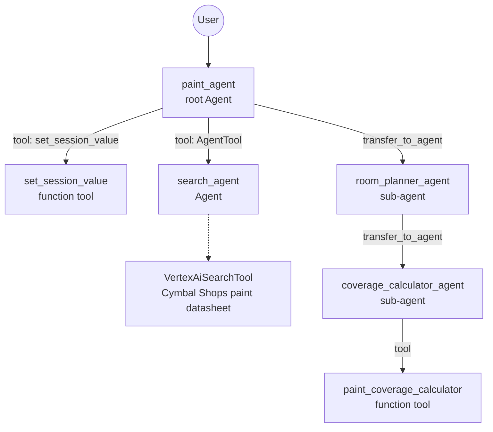

# paint-shopping-assistant

Multi-agent ADK assistant for Cymbal Shops' paint department: browse paint products (grounded in a real product datasheet via Agent Search), pick a room and color, estimate how much paint is needed from room dimensions, and calculate the total price.

Based on Google Cloud Skills Challenge Lab **GENAI129** — "Deploy an Agent with Agent Development Kit (ADK)" (80%+ required to pass), part of the [Build and Deploy Agents with Agent Development Kit (ADK)](https://partner.skills.google/paths/4144) path. Related learning labs referenced by the lab manual: [Get started with ADK](https://partner.skills.google/catalog_lab/32017), [Empower ADK agents with tools](https://partner.skills.google/catalog_lab/32018), [Build multi-agent systems with ADK](https://partner.skills.google/catalog_lab/32044), [Deploy ADK agents to Agent Runtime](https://partner.skills.google/catalog_lab/32019), [Build Agent Search Apps using AI Applications](https://partner.skills.google/catalog_lab/6725).

## Architecture



`paint_agent` (root) shares product info, calls `set_session_value` to remember the customer's choices, and transfers the conversation down the chain: `room_planner_agent` (rooms + color, shows product images keyed off the selected paint) → `coverage_calculator_agent` (room dimensions → paint quantity → final price).

## The lab's central bug (Task 3): search tools can't mix with other tools

The scenario: a coworker left `search_agent` (which uses `VertexAiSearchTool` to query the paint datasheet) wired into `root_agent.sub_agents`, alongside other non-search tools. Running the agent failed with:

```
google.genai.errors.ClientError: 400 INVALID_ARGUMENT. {'error': {'code': 400, 'message':
'Multiple tools are supported only when they are all search tools.', 'status': 'INVALID_ARGUMENT'}}
```

**A search tool can't share an agent with non-search tools — not even indirectly, through a sub-agent.** The fix: pull `search_agent` out of `sub_agents` and wrap it as its own [`AgentTool`](https://github.com/google/adk-python/blob/main/src/google/adk/tools/agent_tool.py) instead, added to `root_agent.tools`:

```python
tools=[
    set_session_value,
    AgentTool(search_agent, False)  # skip_summarization=False: root_agent reports on what the search returns
],
```

This is the same platform restriction documented in [`support-agent`](../support-agent/) (see its README and `agent.py`), solved a different way there (`bypass_multi_tools_limit=True` on the search tool itself, instead of isolating it via `AgentTool`) — worth knowing both patterns.

## Known issue found and fixed (2026-09-03): `set_session_value` never persisted state

The lab's Task 4 asks you to make `set_session_value` store `key`/`value` pairs in `tool_context.state`, so `room_planner_agent` and `coverage_calculator_agent` can later read them back via ADK's key templating (`{SELECTED_PAINT?}`, `{coverage_rate?}`, `{price?}`). The version left after completing the lab only implemented the *status message* half of that:

```python
async def set_session_value(tool_context: ToolContext, key: str, value: str):
    """Sets a value in the tool_context's state dictionary."""
    return f"stored '{value}' in '{key}'"
```

It reports success but never actually writes to state (`tool_context.state[key] = value` was missing) — so `{SELECTED_PAINT?}`, `{coverage_rate?}`, `{price?}` most likely stayed empty throughout the original run, even though the conversation looked coherent (the `?` in key templating means "don't crash if missing," not "warn if missing"). Fixed here to actually persist the value.

## Deployment

```bash
cd paint-shopping-assistant
adk deploy agent_engine --display_name "Paint Agent" .
```

Takes 5-10 minutes. While it deploys, grant the **Agent Platform User** and **Discovery Engine User** IAM roles to the deployed agent's service account. When it finishes, the console prints the deployed agent's resource name (`projects/{project}/locations/{location}/reasoningEngines/{id}`) — save it, the frontend needs it.

### Chainlit frontend

`chainlit_ui/app.py` points at a **hardcoded** resource name from the original (now-destroyed) Qwiklabs project:

```python
agent = client.agent_engines.get(name="projects/241673155115/locations/us-central1/reasoningEngines/1820885263841230848")
```

Replace it with your own deployed agent's resource name, then run:

```bash
cd chainlit_ui
chainlit run app.py
```

## Notes

- **This won't run out of the box.** It needs its own GCP infrastructure: an Agent Search app + data store (`Agent Platform > Agents > Search`) indexing Cymbal Shops' paint datasheet PDF, and the env vars in `.env`/`paint_agent/.env` pointed at your own project. The checked-in `.env` still has the original Qwiklabs project ID and search engine ID — stale, not something to reuse.
- `test_adk.py` at the repo root is a minimal smoke-test script for `agent.async_stream_query`, unrelated to the Paint Agent itself.
