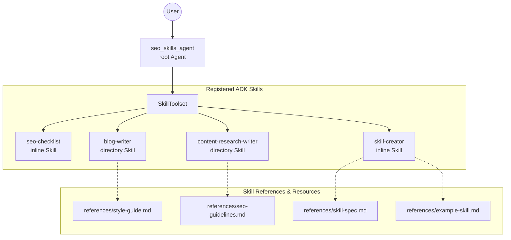

# seo_skills_agent — Use Skills with ADK Agents

Demonstrates using ADK `Skill` definitions and `SkillToolset` to modularize agent capabilities: providing structured checklists, style guides, domain methodologies, and reference documents without overloading the agent's core prompt instructions.

Based on Google Cloud Skills lab **GENAI154** — "Use Skills with ADK Agents", part of the [Build and Deploy Agents with Agent Development Kit (ADK)](https://partner.skills.google/paths/4144) path (course "Craft ADK Agents with Persistent Memories").

## Architecture



The `seo_skills_agent` root agent delegates specialized tasks to four distinct skills:
- **`seo-checklist`** *(inline)*: Quick 9-point on-page SEO review checklist (title length, meta descriptions, heading hierarchy, keyword density, internal/external links, alt text).
- **`blog-writer`** *(directory)*: Loaded from [`skills/blog-writer`](skills/blog-writer/). Guides outline creation, section flow, and code block formatting; references [`style-guide.md`](skills/blog-writer/references/style-guide.md).
- **`content-research-writer`** *(directory)*: Loaded from [`skills/content-research-writer`](skills/content-research-writer/). Guides topic research, keyword strategy, and content planning; references [`seo-guidelines.md`](skills/content-research-writer/references/seo-guidelines.md).
- **`skill-creator`** *(inline)*: Meta-skill that allows the agent to author new ADK-compatible `SKILL.md` skill definitions following the [agentskills.io](https://agentskills.io/) specification.

## Key Features

1. **Modular Skill Management**: Skills can be defined inline as `models.Skill` objects or loaded dynamically from disk directories using `load_skill_from_dir`.
2. **On-Demand Resource Access**: Skills include supporting reference files loaded dynamically via `load_skill_resource`, keeping the base context window lean until detailed domain knowledge is required.
3. **Skill Toolset Integration**: Bundles multiple skills under a single `SkillToolset` tool, allowing the agent to select and apply the right skill or combine multiple skills during multi-turn interactions.

## Setup

Create a `.env` file in the project directory:

```env
GOOGLE_GENAI_USE_ENTERPRISE=1
GOOGLE_CLOUD_PROJECT=<your-project-id>
GOOGLE_CLOUD_LOCATION=global
```

Run the agent locally using `agents-cli` or `adk`:

```bash
cd seo_skills_agent
agents-cli run "Review this blog post outline for SEO optimization and write the introductory section."
```

Or start the web UI:

```bash
adk web
```

## Notes

- **Token Efficiency**: By moving detailed style guides and technical specifications into skill reference files (`references/*.md`), the agent only consumes tokens for detailed guidelines when `load_skill_resource` is triggered.
- **Specification Compliance**: The `skill-creator` tool enforces the Agent Skills specification standard (`kebab-case` naming, YAML frontmatter, max line limits).
