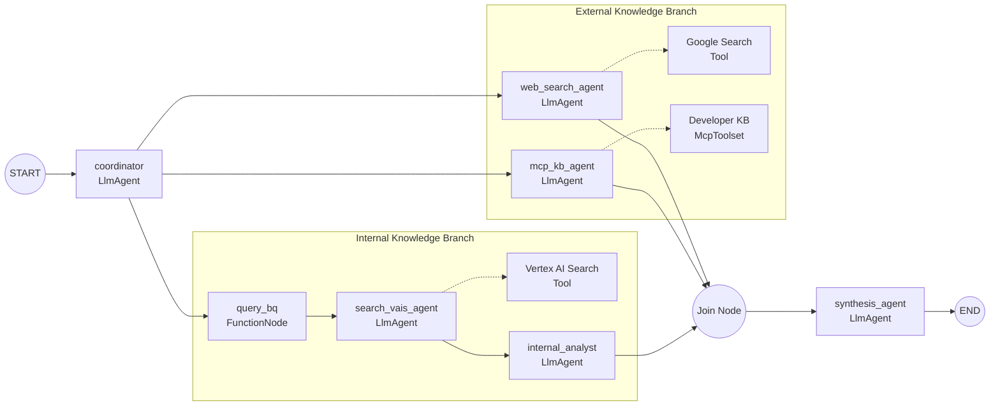

# support-agent — DevSecOps Incident Triage System

Multi-agent system built with ADK 2.0 (Graph Workflow API) that triages production incidents: given an error report, it searches in parallel across 3 sources (past bug history in BigQuery via vector search, internal runbooks indexed in Agent Search/Vertex AI Search, and external developer documentation via MCP + Google Search), then synthesizes a recommendation that always prioritizes internal knowledge over external.

Based on lab GENAI162 — "Build and Deploy Multi-Agent ADK Systems to Gemini Enterprise" (course 1 of the [Build and Deploy Agents with ADK](https://partner.skills.google/paths/4144) path).



The `Join Node` is a synchronization barrier: it waits for all 3 branches to finish (they take different amounts of time) before passing everything together to the `synthesis_agent`, which applies explicit grounding rules — internal knowledge always wins over external unless there's no internal match.

**Note:** this code needs its own GCP infrastructure to actually run (an Agent Search datastore with your own runbooks, a BigQuery table with post-mortems + embeddings, access to the MCP server registered in Agent Registry) — it won't work "out of the box" outside the original Qwiklabs environment it was built in. See `.env.example` for the required variables.

**On mixing search tools with other tools:** `search_vais_agent`/`web_search_agent` avoid Agent Platform's "search tool can't share an agent with non-search tools" restriction via `bypass_multi_tools_limit=True` on the tool itself (see `agent.py`). [`paint-shopping-assistant`](../paint-shopping-assistant/) hits the same restriction and solves it differently — by isolating the search agent behind an `AgentTool()` instead — worth comparing the two approaches.

## Project Structure

```
support-agent/
├── app/         # Core agent code
│   ├── agent.py               # Main agent logic
│   ├── fast_api_app.py        # FastAPI Backend server
│   └── app_utils/             # App utilities and helpers
├── tests/                     # Unit, integration, and load tests
├── GEMINI.md                  # AI-assisted development guide
└── pyproject.toml             # Project dependencies
```

> 💡 **Tip:** Use [Antigravity CLI](https://antigravity.google/) for AI-assisted development - project context is pre-configured in `GEMINI.md`.

## Requirements

Before you begin, ensure you have:
- **uv**: Python package manager (used for all dependency management in this project) - [Install](https://docs.astral.sh/uv/getting-started/installation/) ([add packages](https://docs.astral.sh/uv/concepts/dependencies/) with `uv add <package>`)
- **agents-cli**: Agents CLI - Install with `uv tool install google-agents-cli`
- **Google Cloud SDK**: For GCP services - [Install](https://cloud.google.com/sdk/docs/install)


## Quick Start

Install `agents-cli` and its skills if not already installed:

```bash
uvx google-agents-cli setup
```

Install required packages:

```bash
agents-cli install
```

Test the agent with a local web server:

```bash
agents-cli playground
```

You can also use features from the [ADK](https://adk.dev/) CLI with `uv run adk`.

## Commands

| Command              | Description                                                                                 |
| -------------------- | ------------------------------------------------------------------------------------------- |
| `agents-cli install` | Install dependencies using uv                                                         |
| `agents-cli playground` | Launch local development environment                                                  |
| `agents-cli lint`    | Run code quality checks                                                               |
| `agents-cli eval`    | Evaluate agent behavior (generate, grade, analyze, and more — see `agents-cli eval --help`) |
| `uv run pytest tests/unit tests/integration` | Run unit and integration tests                                                        || [A2A Inspector](https://github.com/a2aproject/a2a-inspector) | Launch A2A Protocol Inspector                                                        |

## 🛠️ Project Management

| Command | What It Does |
|---------|--------------|
| `agents-cli scaffold enhance` | Add CI/CD pipelines and Terraform infrastructure |
| `agents-cli infra cicd` | One-command setup of entire CI/CD pipeline + infrastructure |
| `agents-cli scaffold upgrade` | Auto-upgrade to latest version while preserving customizations |

---

## Development

Edit your agent logic in `app/agent.py` and test with `agents-cli playground` - it auto-reloads on save.

## Deployment

### 1. Deploy to Agent Runtime

```bash
gcloud config set project <your-project-id>
agents-cli deploy
```

This can take 5-10 minutes to provision the managed backend. It runs in the foreground waiting for confirmation — **if you interrupt it (`Ctrl+C`) before it finishes, the deployment keeps running on Cloud regardless** (it's a long-running operation, not tied to the terminal session), but you won't see the final `✅ Deployment successful!` message with the real Agent Runtime ID. Recover it with:

```bash
agents-cli deploy --status
```

The output gives you the **Agent Runtime ID as a full resource path**, e.g.:

```
projects/{project_number}/locations/{location}/reasoningEngines/{id}
```

Save it — you'll need the full path (not just the trailing `{id}`) for the next step.

### 2. Register in Gemini Enterprise

```bash
agents-cli publish gemini-enterprise \
  --registration-type=adk \
  --gemini-enterprise-app-id="projects/{project_number}/locations/{location}/collections/default_collection/engines/{your-app-id}" \
  --agent-runtime-id="projects/{project_number}/locations/{location}/reasoningEngines/{id}" \
  --display-name="DevSecOps Incident Triage System" \
  --description="Queries internal post-mortems and summarizes web workarounds for database outages"
```

Two gotchas confirmed in practice, neither obvious from the flags' names:

- **Both `--agent-runtime-id` and `--gemini-enterprise-app-id` require the full resource path**, not the bare numeric ID / app name — passing just the ID fails with `Error: Invalid ... format`.
- **The two resources can live in different regions.** In the original lab, the Agent Runtime was deployed to `us-central1` while the Gemini Enterprise App lives in `us` (defined separately when you create the App in the Cloud Console). Easy to mix up if you assume they share a location.

The Agent Runtime's managed service account (`service-{project_number}@gcp-sa-aiplatform-re.iam.gserviceaccount.com`) doesn't exist until explicitly requested, and needs `agentregistry.viewer` + `discoveryengine.viewer` granted **before** deploying, not after:

```bash
gcloud beta services identity create --service=aiplatform.googleapis.com --project=<your-project-id>
gcloud projects add-iam-policy-binding <your-project-id> \
  --member="serviceAccount:service-{project_number}@gcp-sa-aiplatform-re.iam.gserviceaccount.com" \
  --role="roles/agentregistry.viewer"
gcloud projects add-iam-policy-binding <your-project-id> \
  --member="serviceAccount:service-{project_number}@gcp-sa-aiplatform-re.iam.gserviceaccount.com" \
  --role="roles/discoveryengine.viewer"
```

### 3. Share with the organization

Registering the agent doesn't make it usable — sharing does. In the Gemini Enterprise console: **App → Agents → (your agent) → User permissions → Add user → Member type: All users → Assign role: Agent User → Save.**

### Other scaffolding commands

To add CI/CD and Terraform, run `agents-cli scaffold enhance`.
To set up your production infrastructure, run `agents-cli infra cicd`.

> ⚠️ `agents-cli scaffold enhance --deployment-target <target>` (used to add a new deploy target to an existing project) can silently overwrite `pyproject.toml` with a generic boilerplate. If you run it, verify `app/agent.py` wasn't touched and re-sync dependencies: `rm -f pyproject.toml && uv init --bare && uv add -r app/requirements.txt`.

## Observability

Built-in telemetry exports to Cloud Trace, BigQuery, and Cloud Logging.

## A2A Inspector

This agent supports the [A2A Protocol](https://a2a-protocol.org/). Use the [A2A Inspector](https://github.com/a2aproject/a2a-inspector) to test interoperability.
See the [A2A Inspector docs](https://github.com/a2aproject/a2a-inspector) for details.
