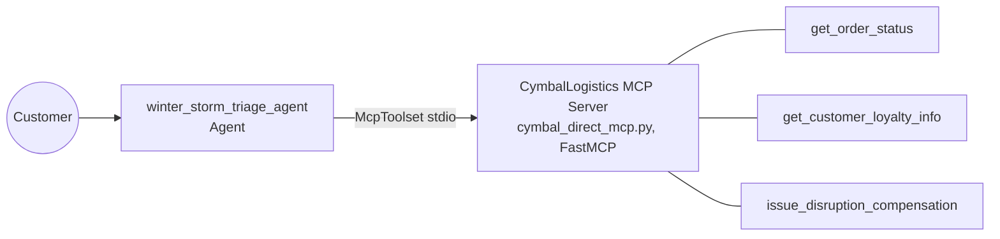

# winter-storm-triage

Cymbal Direct Winter Storm Triage Agent — a single ADK agent that triages customer orders delayed by a severe winter storm: looks up the order and the customer's loyalty tier via a mock logistics MCP server, applies a tier-based compensation policy, issues the credit + shipping upgrade, and drafts an empathetic customer response.

Based on Google Cloud Skills Challenge Lab **GENAI144** — "Accelerate Development with Antigravity", part of the [Use Agents to Build Agents](https://partner.skills.google/paths/3476) path.

## Architecture



The simplest architecture of the four projects in this repo: one `Agent`, no sub-agents, no graph — contrast with [`ambient-expense-agent`](../ambient-expense-agent/)'s conditional-routing `Workflow` (deterministic auto-approve/policy-violation/LLM-review branches) or [`support-agent`](../support-agent/)'s fan-out/join graph. `McpToolset` + `StdioConnectionParams` spawns `cymbal_direct_mcp.py` as a local subprocess and talks to it over stdio — no external database, the "logistics system" is just in-memory Python dicts (5 orders, 5 customers spanning all 4 loyalty tiers, plus one already-delivered order as a negative case).

## Compensation policy

Hardcoded in the agent's instruction (`app/agent.py`) and mirrored in the `winter-storm-triage` Antigravity skill that generated it:

| Tier | Credit | Shipping upgrade |
|------|--------|-------------------|
| Platinum | $100 | Next-Day Air |
| Gold | $50 | Next-Day Air |
| Silver | $25 | 3-Day Select |
| Member | $10 | Priority Shipping |

Flow per inquiry: `get_order_status` (finds the order + `customer_id`) → `get_customer_loyalty_info` (finds the tier) → `issue_disruption_compensation` (applies the table above) → draft the customer-facing response.

## Built via Antigravity, not by hand

Unlike [`support-agent`](../support-agent/) and [`paint-shopping-assistant`](../paint-shopping-assistant/), most of this one was built by prompting the **Antigravity CLI (`agy`)** in natural language rather than writing code directly — that's the actual skill GENAI144 tests. Roughly, in order:

1. **Register the MCP server** — a `.agents/mcp_config.json` pointing `agy` at the local `cymbal_direct_mcp.py` script (this is a separate, earlier wiring than the `McpToolset`/`StdioConnectionParams` that ends up in `app/agent.py` — the config file is how `agy` itself talks to the MCP server during the chat session, before anything gets scaffolded into a deployable agent).
2. **Author the workspace rule and the skill**, by asking `agy` directly:
   > *"Add rules to a GEMINI.md file... configured as always_on... All new Python code files must start with a docstring... a commented copyright statement for 'Cymbal Direct'..."*
   > *"Create an agent skill named winter-storm-triage. ... Apply the following compensation based on loyalty tier: ..."*

   (`app/agent.py`'s copyright header and module docstring are a direct result of that rule.)
3. **Scaffold the deployable agent** with `agents-cli`, again via a prompt to `agy` rather than typing `agents-cli` commands directly: *"Use your agents-cli skills to build a winter storm triage agent based on the MCP server."*
4. **Deploy**, once more via `agy`: *"Deploy the winter storm triage agent to Agent Runtime... Make sure to copy the local `cymbal_direct_mcp.py` file into the agent's `app/` directory before deployment."* That last instruction matters mechanically: since the MCP connection is a local subprocess over stdio, the script has to be physically inside the deployed package — it can't be referenced from outside like an HTTP-based MCP server (contrast with [`support-agent`](../support-agent/), which resolves its MCP server through Agent Registry over the network instead).

## Deployment

Deployed with `agents-cli deploy` (invoked by `agy`, see above). Real result from this run, captured in `summary_task5.md`:

- **Reasoning Engine**: `projects/364121932452/locations/us-west1/reasoningEngines/7770706070330146816`
- **Region**: `us-west1`
- **Service account**: `service-364121932452@gcp-sa-aiplatform-re.iam.gserviceaccount.com`

To redeploy your own copy:

```bash
cd winter-storm-triage
agents-cli deploy
```

## Notes

- **Runs more standalone than `support-agent`/`paint-shopping-assistant`** — no BigQuery table or Agent Search datastore to provision, since the "logistics system" is in-memory mock data inside `cymbal_direct_mcp.py` itself. You still need a GCP project (or a Gemini API key) for the model calls themselves — see `.env.example`.
- `summary_task2.md` through `summary_task5.md` are the grading artifacts Antigravity generated during the lab (per-task summaries requested by the manual for automated scoring) — kept here as a real record of what the agent actually produced, not just what the manual claims it should produce.
- `GEMINI.md` in this repo is the generic `agents-cli` scaffold guide (development phases, commands), not the project-specific rules file from step 2 above — that one lived at the workspace root during the lab (`~/genai144-challenge/GEMINI.md`) and wasn't carried over when the scaffolded `winter-storm-triage/` subfolder was copied into this repo.
